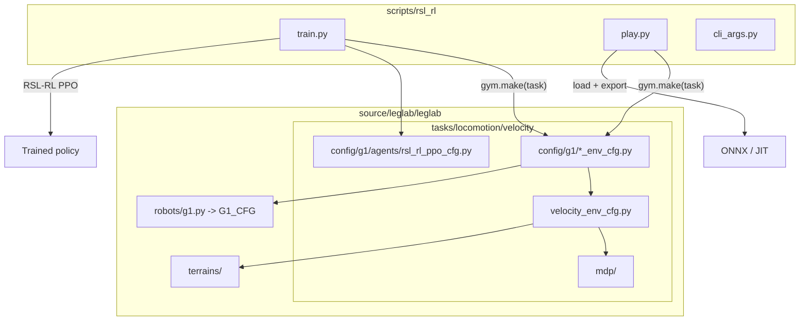
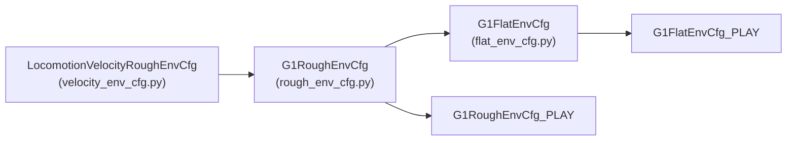

# Architecture

LegLab is a thin, focused Isaac Lab extension. It reuses Isaac Lab's manager-based
reinforcement-learning framework and adds a humanoid locomotion task, a G1 robot
configuration, custom terrains, and training scripts.

## Component overview

## Environment stack

Each task is registered with Gymnasium and uses Isaac Lab's standard
`ManagerBasedRLEnv` entry point. The configuration is layered so that robot-agnostic
settings live in the base and robot-specific overrides live in the leaf configs.

- `velocity_env_cfg.py` defines the scene (terrain, robot placeholder, height scanner,
  contact sensors, lights) and the MDP managers: commands, actions, observations, events,
  rewards, terminations, and curriculum.
- `rough_env_cfg.py` binds the `G1_CFG` robot, sets G1-specific reward weights and
  termination bodies, and configures rough-terrain randomization.
- `flat_env_cfg.py` switches to a flat plane, removes the height scanner and terrain
  curriculum, and retunes rewards for flat-ground walking.
- The `_PLAY` variants shrink the scene and disable observation noise and pushes for
  clean evaluation and video capture.

## MDP

The Markov decision process is assembled from term configs in
`tasks/locomotion/velocity/mdp/`, combined with Isaac Lab's built-in MDP terms
(`from isaaclab.envs.mdp import *`).

- **Commands** — uniform base-velocity command (linear x/y, yaw) with heading control.
- **Actions** — joint position targets with a default-offset scale.
- **Observations** — base linear/angular velocity, projected gravity, velocity command,
  joint positions and velocities, last action, and (rough only) a height scan, all with
  additive uniform noise during training.
- **Rewards** — velocity tracking in the yaw frame, foot air-time and slide shaping,
  joint-deviation and joint-limit penalties, and effort/acceleration regularization.
- **Events** — startup material/mass randomization, reset pose/joint randomization, and
  periodic velocity pushes.
- **Terminations** — time-out plus illegal base/torso contact.
- **Curriculum** — terrain-level progression for the rough task.

## Training loop

`scripts/rsl_rl/train.py` launches Isaac Sim, builds the environment from the task's
config entry point, wraps it for RSL-RL, and runs PPO using the matching
`RslRlOnPolicyRunnerCfg` (`config/g1/agents/rsl_rl_ppo_cfg.py`). Checkpoints and the
resolved config are written under `logs/rsl_rl/<experiment_name>/` (e.g.
`logs/rsl_rl/leglab_g1_flat/`).

`scripts/rsl_rl/play.py` reloads a checkpoint, runs inference, and exports the policy to
both TorchScript (`policy.pt`) and ONNX (`policy.onnx`) for use outside Isaac Lab.
